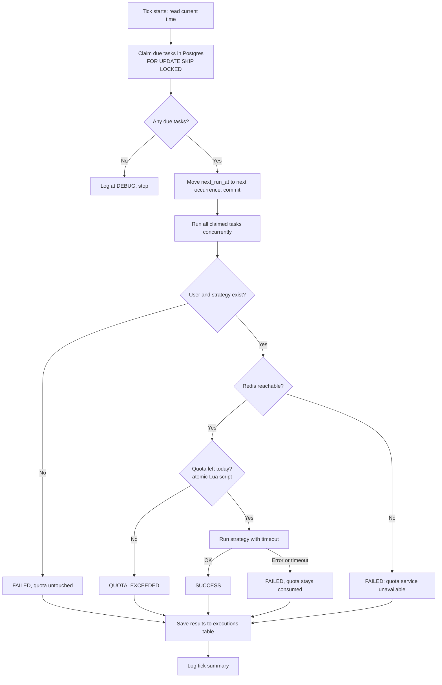

# Task Scheduler Service

A FastAPI backend that accepts tasks submitted by users, runs each task once a day at
its scheduled time, and caps how many executions each user gets per day.

This project refactors a single-file legacy script (a global `users` dict, a global
`tasks` list, and a `run()` loop built on `print`) into separate modules with clear
responsibilities. Every action is simulated: `sync`, `backup`, and `delete` write a log
line and never touch the filesystem.

## Quick Start

You need Python 3.12, a running Postgres 16, and a running Redis. For local development:

```bash
docker run -d --name postgres -e POSTGRES_USER=postgres -e POSTGRES_PASSWORD=<password> -p 5432:5432 postgres:16
docker run -d --name redis -p 6379:6379 redis:latest redis-server --requirepass "<password>"
```

Then set up the app (Windows paths shown; use `.venv/bin/` on macOS and Linux):

```bash
python -m venv .venv
.venv/Scripts/python -m pip install -r requirements-dev.txt
cp .env.example .env                      # fill in the two passwords
.venv/Scripts/python scripts/create_databases.py
.venv/Scripts/alembic upgrade head
.venv/Scripts/fastapi dev app/main.py
```

`scripts/create_databases.py` only creates `task_scheduler` and `task_scheduler_test`
when they're missing, so it's safe on a Postgres server other projects share.

With `SEED_DEMO_DATA=true`, startup loads the legacy users and tasks. Interactive docs
live at `http://127.0.0.1:8000/docs`.

## API

Everything under `/api/v1` answers with one envelope:
`{"success", "data", "error": {"code", "message", "error_id"}, "meta": {"total", "page", "limit"}}`.

| Method | Path | Purpose |
|---|---|---|
| POST | `/api/v1/users` | Register `{"username", "daily_quota"}` |
| GET | `/api/v1/users/{username}` | User plus today's usage |
| GET | `/api/v1/actions` | Registered actions with their params JSON schema |
| POST | `/api/v1/tasks` | Submit `{"user", "time": "HH:MM", "action", "params"}` |
| GET | `/api/v1/tasks?user=&page=&limit=` | List tasks |
| POST | `/api/v1/scheduler/tick` | Run one tick now |
| GET | `/api/v1/executions?user=&status=&page=&limit=` | Execution history, newest first |
| GET | `/health` | Postgres and Redis status, `503` if either is down |

```bash
curl -X POST localhost:8000/api/v1/tasks -H "content-type: application/json" \
  -d '{"user": "alice", "time": "12:00", "action": "sync", "params": {"target": "/data/x"}}'
```

## Testing

```bash
.venv/Scripts/python -m pytest --cov=app        # unit + integration, about 15 s
.venv/Scripts/python -m pytest -m e2e           # real server and clock, about 1 min
.venv/Scripts/ruff check . && .venv/Scripts/mypy app
```

| Suite | What runs | Needs |
|---|---|---|
| `tests/unit` | Domain, strategies, services, and scheduler with in-memory fakes and a fake clock | Nothing |
| `tests/integration` | SQL repositories, Redis quota script, migration, and the HTTP API | Postgres + Redis |
| `tests/e2e` | A real uvicorn process whose background loop runs tasks at the next wall-clock minute | Postgres + Redis |

Integration and e2e tests use `TEST_DATABASE_URL` and `TEST_REDIS_URL`. They truncate
only the three tables in `task_scheduler_test` and delete only `task_scheduler:*` keys.

Two tests guard the concurrency rules, and each was checked against a broken version:
- Without `FOR UPDATE SKIP LOCKED`, four parallel ticks claimed 80 times for 20 tasks.
- A plain GET-then-INCR let 5 of 10 concurrent calls through a quota of 3.

Current status: 105 unit and integration tests plus 1 e2e test pass, with 99% line
coverage of `app/`. `ruff` and `mypy --strict` both pass.

## Business Rules

1. **Users have a daily quota.** Each user has `daily_quota` executions per calendar day.
   The count resets on its own when the date changes; no reset job exists.
2. **A user can own any number of tasks.** Several tasks can share the same time.
3. **A task runs at most once per day.** Each task stores its `next_run_at`. It becomes
   due when the current time reaches that moment, and claiming it moves `next_run_at`
   to the next occurrence after now.
4. **Late checks catch up, once.** If the scheduler checks at 12:03, a 12:00 task still
   runs. If the scheduler was down for three days, the task runs once when it comes
   back, not three times.
5. **New tasks start at their next occurrence.** A 12:00 task submitted at 15:00 first
   runs tomorrow at 12:00, not right away.
6. **An attempt costs quota, success or not.** A failed run still used resources, and
   this rule stops unlimited retries.
7. **Configuration mistakes cost nothing.** If the user was deleted or the action isn't
   registered, the run fails before any quota is taken.
8. **No quota check, no run.** If Redis can't be reached, the task doesn't run and the
   result is `FAILED`. Skipping a run is safer than running without a limit.
9. **A day follows one time zone,** set in config (default `Asia/Jakarta`). "Today" for
   both quota and scheduling uses that zone.

## Business Flow

### 1. Register a user

A client registers a username with a `daily_quota`. Duplicate usernames are rejected.

### 2. Submit a task

A client submits a task as a dictionary:

```json
{
  "user": "alice",
  "time": "12:00",
  "action": "sync",
  "params": { "target": "/data/x" }
}
```

The service checks this input before saving anything:

- the user exists;
- the action has a registered strategy;
- `params` matches that strategy's parameter model (for example, `sync` requires
  `target`, while `backup` takes `target` plus an optional `destination`).

A task with bad parameters is rejected at submission time, not at 12:00 when it would
have run. On save, the service sets `next_run_at` to the first occurrence of `time`
after the moment of submission.

### 3. Daily execution (one scheduler tick)

A background loop calls `Scheduler.tick()` every few seconds (configurable). An API
endpoint can trigger a tick manually.



Claiming a task and moving its `next_run_at` happen in one transaction, whatever the
result turns out to be. A task rejected for quota therefore won't be retried later the
same day.

`SKIP LOCKED` lets two ticks run at the same moment, whether from the background loop
and the manual endpoint or from two app instances, without both claiming the same task.

### 4. Execution results

| Status | Meaning | Quota consumed |
|---|---|---|
| `SUCCESS` | The strategy finished | Yes |
| `FAILED` | Unknown user or action, bad params, Redis unreachable, exception, or timeout | Only if the strategy started |
| `QUOTA_EXCEEDED` | The user had used all of today's quota | No |

Every result is stored in the `executions` table and can be read back through the API.

## Worked Example

This uses the legacy data: `alice` has a quota of 3 and `bob` a quota of 5. Suppose
`alice` then submits two more 12:00 tasks, bringing her to four.

| Task | User | Action | Result at 12:00 | Alice's usage |
|---|---|---|---|---|
| 1 | alice | sync `/data/x` | SUCCESS | 1/3 |
| 2 | bob | backup `/srv/y` | SUCCESS | (bob 1/5) |
| 3 | alice | delete `/tmp/z` | SUCCESS | 2/3 |
| 4 | alice | sync `/data/a` | SUCCESS | 3/3 |
| 5 | alice | sync `/data/b` | QUOTA_EXCEEDED | 3/3 |

All five tasks run concurrently, so the order in which alice's tasks claim quota isn't
fixed. What stays fixed is that exactly three of her four tasks succeed. The next day,
her usage starts again at 0/3 and all four tasks are due again at 12:00.

## Changes From the Legacy Script

| Legacy behavior | Problem | Now |
|---|---|---|
| `executed` only ever grows | After day one, a user is locked out for good | Usage is counted per day in Redis and resets when the date changes |
| Exact `HH:MM` string match | A late check skips the task; two checks in one minute run it twice | Due when `next_run_at <= now`; claiming moves it to the next day |
| `users[user]` lookup | An unknown user crashes the loop with `KeyError` | `UserNotFoundError` with a clear message; other tasks keep running |
| `print` | No levels, no context, no way to trace | `logging` with `tick_id`, `task_id`, and `user` on every line |
| `action` is a bare string | Each new action means editing the loop | One `ActionStrategy` class per action, looked up in a registry |
| Global mutable dicts | Lost on restart, hard to test, unsafe with more than one process | Postgres for users, tasks, and history; Redis for quota counters |

## Architecture

```text
app/
├── main.py          # App factory, lifespan starts and stops the scheduler loop
├── core/            # Settings, logging setup, Clock
├── domain/          # Plain models (User, Task, ExecutionResult) and domain errors
├── strategies/      # ActionStrategy base, registry, sync/backup/delete
├── db/              # Async engine and session factory
├── models/          # SQLAlchemy ORM tables
├── repositories/    # Postgres repositories and the Redis quota store
├── services/        # Users, tasks, quota, executor, scheduler
├── schemas/         # Pydantic request/response models
└── api/             # FastAPI routes and dependency wiring
```

Dependencies point one way: `api` → `services` → `domain`, `strategies`,
`repositories`. Services work with the plain models in `domain/`, not ORM objects, and
talk to storage through repository interfaces. Unit tests swap in in-memory fakes, so
the scheduling logic runs without Postgres, Redis, or HTTP. The current time comes from
an injected `Clock`, which lets tests cover midnight resets and late checks without
waiting.

### Storage

| Store | Holds | Notes |
|---|---|---|
| Postgres, database `task_scheduler` | `users`, `tasks`, `executions` | Schema managed by Alembic migrations |
| Redis, db index 1 | Daily quota counters | Key `task_scheduler:quota:{username}:{YYYY-MM-DD}`, expires after 48 hours |

Tests use the `task_scheduler_test` database and Redis db index 2, and they only delete
keys with the `task_scheduler:` prefix.

If Redis restarts mid-day, that day's counters are lost and users may run past their
quota until midnight. The `executions` table still keeps the full history. This
trade-off is accepted for this project.

### Adding an action

Create a subclass of `ActionStrategy` with a `name`, a Pydantic `params_model`, and an
`async execute()` method, then register it in the registry. The executor and scheduler
don't change.

## Logging and Errors

Each log line carries the tick, task, and user it belongs to:

```text
2026-09-24 12:00:01 INFO    app.scheduler  [tick=7f3a task=-      user=-    ] 3 tasks due
2026-09-24 12:00:01 INFO    app.executor   [tick=7f3a task=a1b2c3 user=alice] Running sync target=/data/x
2026-09-24 12:00:01 WARNING app.executor   [tick=7f3a task=d4e5f6 user=alice] Quota exceeded (3/3 today), task skipped
2026-09-24 12:00:02 ERROR   app.executor   [tick=7f3a task=9c8b7a user=bob  ] backup failed: timed out after 30s
```

Domain errors return clear messages, such as
`Unknown action 'archive'. Available: backup, delete, sync`. Unexpected errors return a
generic `500` with an `error_id`; the full traceback goes to the log under the same ID.
If Postgres drops during a tick, the loop logs the error and tries again on the next
tick.

`GET /health` checks Postgres and Redis and returns `503` naming whichever one is down.
